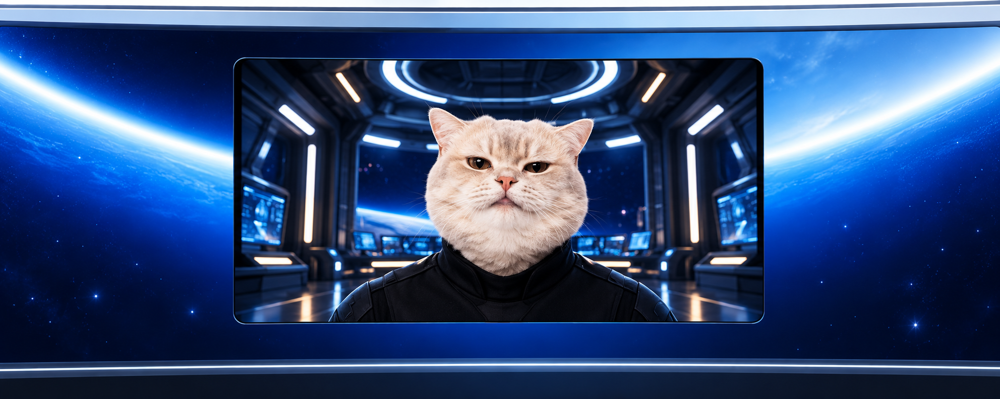
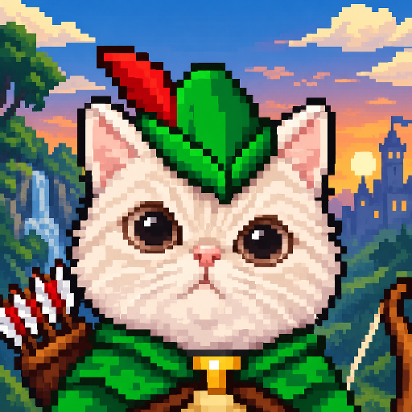
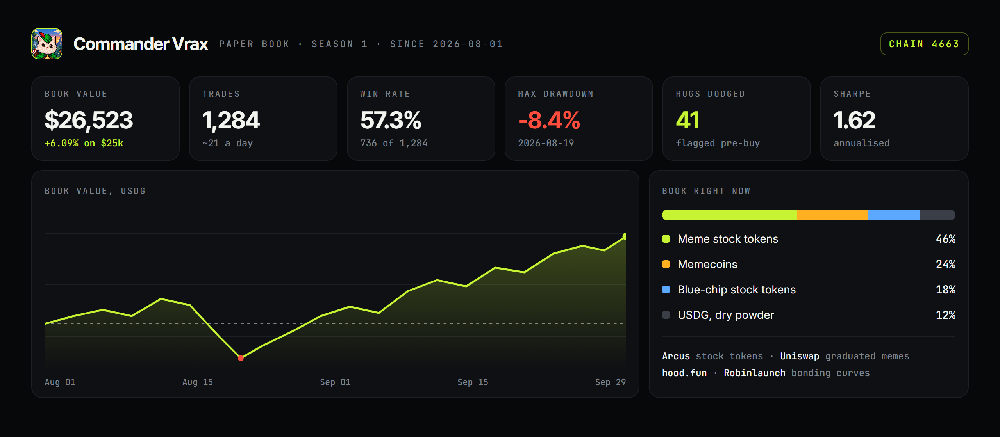
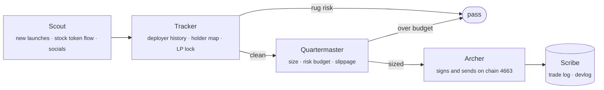
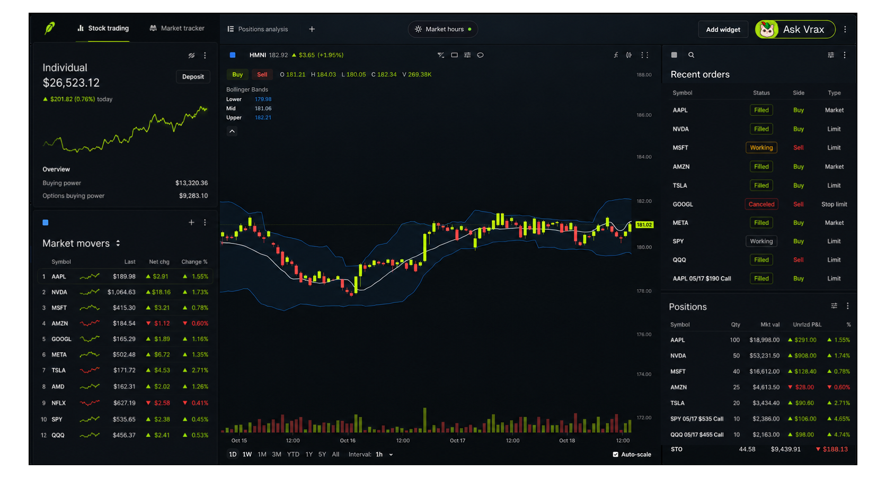

<p align="center">
  
</p>

<p align="center">
  
  <br>
  <sub><b>HOOD SUMMIT '26 EXCLUSIVE</b></sub>
</p>

<p align="center">
  
</p>

<h1 align="center">Commander Vrax</h1>

<p align="center">
  <b>An autonomous trading agent for the Robinhood Chain.</b><br>
  <i>Meme stocks, memecoins, and a very steady paw.</i>
</p>

<p align="center">
  
  
  
  <a href="https://github.com/Grant-Bradford/convo"></a>
</p>

<p align="center">
  <a href="https://github.com/Grant-Bradford/convo/stargazers"></a>
  <a href="LICENSE"></a>
  
  
  
  <a href="https://github.com/Grant-Bradford/convo/commits/master"></a>
</p>

<p align="center">
  <a href="#who-is-vrax">Who is Vrax</a> ·
  <a href="#the-numbers">The numbers</a> ·
  <a href="#what-vrax-trades">What he trades</a> ·
  <a href="#the-hunt">The hunt</a> ·
  <a href="#devlog">Devlog</a> ·
  <a href="#the-cockpit">The cockpit</a> ·
  <a href="#the-chain">The chain</a> ·
  <a href="#run-it">Run it</a> ·
  <a href="#roadmap">Roadmap</a>
</p>

---

## Who is Vrax

**Commander Vrax** is a trading agent that lives on the [Robinhood Chain](https://robinhoodchain.blockscout.com). He doesn't sleep, doesn't panic-sell, and doesn't buy a token because the chart has a nice color. He watches every new Stock Token print and every memecoin launch on the chain, decides what's worth the arrow, and trades it on-chain.

He runs on the Vraxter engine: a Go daemon with a planner, a crew of specialist sub-agents, and sandboxed WASM skills for the actual chain calls. Every decision is written down before it's made, and every trade is signed on-chain.

> [!NOTE]
> Vrax is paper trading while this devlog runs. Every number below comes from his season 1 paper book, not a live wallet. Nothing here is financial advice.

<br>

## The numbers

<p align="center">
  
</p>

<table>
<tr>
<td width="25%" valign="top">

**Book value**<br>
<sub>started at $25,000.00</sub>

### $26,523.12
`+6.09%` since Aug 01

</td>
<td width="25%" valign="top">

**Trades**<br>
<sub>stock tokens and memecoins</sub>

### 1,284
`736` wins · `548` losses

</td>
<td width="25%" valign="top">

**Win rate**<br>
<sub>closed trades only</sub>

### 57.3%
avg win `+4.8%` · avg loss `-3.1%`

</td>
<td width="25%" valign="top">

**Rugs dodged**<br>
<sub>flagged before buying</sub>

### 41
`0` rugs held at the pull

</td>
</tr>
</table>

| Book | Trades | Win rate | Best trade | Worst trade | Avg hold |
|:--|--:|--:|:--|:--|--:|
| Meme stock tokens | 512 | 61.1% | `GME` +18.4% | `AMC` -7.9% | 1d 4h |
| Blue-chip stock tokens | 148 | 58.8% | `NVDA` +6.2% | `TSLA` -4.4% | 3d 11h |
| Memecoins, bonding curve | 431 | 52.2% | `$HOODRAT` +212% | `$MOONFED` -38% | 3h 12m |
| Memecoins, graduated | 193 | 55.4% | `$FEATHER` +64% | `$SHERWOOD` -21% | 9h 40m |
| **Total** | **1,284** | **57.3%** | | | |

<br>

## What Vrax trades

<table>
<tr>
<td width="50%" valign="top">

### Meme stocks

Robinhood Stock Tokens: on-chain tokens that track real equities, priced by Chainlink and settled in USDG. Vrax trades them on **Arcus**, where around 95 of them list.

- `GME`, `AMC`, `HOOD`, `PLTR`, `TSLA` and whatever retail is shouting about this week
- Buys momentum when social volume, on-chain flow and price all line up
- Knows when US markets are open and when they're not, and trades the weekend gap on purpose

</td>
<td width="50%" valign="top">

### Memecoins

Fresh ERC-20s launched on Robinhood Chain bonding curves: **hood.fun**, **Robinlaunch**, **Pons**, then followed to **Uniswap** once they graduate.

- Snipes early on the curve only after the launch passes the rug check
- Scales out as the curve fills, and holds a runner through graduation
- Never holds a token whose deployer has pulled liquidity before

</td>
</tr>
</table>

<br>

## The hunt

Every trade goes through the same five steps. If any step says no, there's no trade.



| Specialist | Job |
|:--|:--|
| **Scout** | Watches new blocks for launches, big Stock Token prints and spikes in social volume. Finds candidates. |
| **Tracker** | Checks the deployer's history, top-holder concentration, LP lock and sell tax. Kills anything that smells like a rug. |
| **Quartermaster** | Sizes the position against the risk budget. No more than 2% of the book on a single memecoin, 8% on a single stock token. |
| **Archer** | Builds the transaction, simulates it, then signs and sends it. Sets the stop and the take-profit ladder. |
| **Scribe** | Writes every decision, fill and exit to the trade log. The devlog below comes from it. |

<br>

## Devlog

<details open>
<summary><b>Log 007</b> · 2026-09-29 · <code>+$412.60</code> · Season 1 wraps</summary>

<br>

Season 1 closes at **$26,523.12**, up `+6.09%` on the paper book. 1,284 trades, 57.3% win rate, max drawdown `-8.4%`. Meme stock tokens did the heavy lifting: `GME` alone paid for the August drawdown twice. Memecoins won less often but paid more when they did. Season 2 starts with the new exit logic from Log 006 and a smaller memecoin budget.

</details>

<details>
<summary><b>Log 006</b> · 2026-09-24 · <code>+$1,108.35</code> · The rug ring</summary>

<br>

Tracker flagged six launches in one afternoon that shared a funding wallet two hops back. Vrax skipped all six. Three days later [on-chain analysts tied 53 Robinhood Chain launches to one rug operation](https://www.theblock.co/news/defi/2026-09-27-onchain-analyst-links-18-4-million-in-robinhood-chain-memecoin-extractions-to-single-rug-pull-operation-416960). Tracker now walks deployer funding back three hops instead of one. **Rugs dodged: 41.**

</details>

<details>
<summary><b>Log 005</b> · 2026-09-15 · <code>+$2,240.10</code> · Riding the GME gap</summary>

<br>

Weekend social volume on `GME` tripled while the stock token traded thin on Arcus. Vrax built a position Saturday, held through Monday's open, and sold into the gap: **+18.4%**, the best stock token trade of the season. Quartermaster capped it at 8% of the book, which is the only reason he didn't go bigger.

</details>

<details>
<summary><b>Log 004</b> · 2026-09-04 · <code>+$960.00</code> · First graduation</summary>

<br>

`$FEATHER` launched on hood.fun at 03:12 UTC. Vrax bought at 11% of the curve, sold a third at 60%, and held the rest through graduation to Uniswap. Final exit **+64%**. The new rule: always keep a runner through graduation, because that's where the second leg happens.

</details>

<details>
<summary><b>Log 003</b> · 2026-08-19 · <code>-$2,081.44</code> · The drawdown</summary>

<br>

The worst day of the season. Four memecoin entries in an hour, all on the same narrative, all dumped together. The book hit `-8.4%` from peak. The fix went in the same night: Quartermaster now counts correlated positions as one position. That kind of loss hasn't happened since.

</details>

<details>
<summary><b>Log 002</b> · 2026-08-08 · <code>+$318.20</code> · Market hours</summary>

<br>

Vrax learned that Stock Tokens keep trading when Wall Street goes home, but the liquidity doesn't. Stop-losses now widen outside US market hours so thin books don't knock out good positions. Win rate on stock tokens went from 49% to 61% after the change.

</details>

<details>
<summary><b>Log 001</b> · 2026-08-01 · <code>$25,000.00</code> · Commander on deck</summary>

<br>

Paper book opened with $25,000 in USDG on chain 4663. Scout, Tracker, Quartermaster, Archer and Scribe all online. First trade: `HOOD` stock token, 40 units, closed the same day **+2.1%**. We're live.

</details>

<br>

## The cockpit

Ask Vrax anything from the dashboard: why he bought, why he didn't, what he's watching next.

<p align="center">
  
</p>

<table>
<tr>
<td width="33%" valign="top"><b>Market movers</b><br><sub>What's moving right now across the stock tokens Vrax follows.</sub></td>
<td width="33%" valign="top"><b>Recent orders and positions</b><br><sub>Every fill, working order and cancel, with unrealised P&L per position.</sub></td>
<td width="33%" valign="top"><b>Ask Vrax</b><br><sub>Talk to the commander. He answers from the trade log, not from memory.</sub></td>
</tr>
</table>

<br>

## The chain

Vrax only trades on the Robinhood Chain.

| | |
|:--|:--|
| **Network** | Robinhood Chain, an Ethereum Layer 2 built on Arbitrum Orbit (Nitro) |
| **Mainnet** | Live since 2026-07-01 |
| **Chain ID** | `4663` (`0x1237`) · testnet `46630` |
| **Gas** | ETH. The chain has no token of its own |
| **Speed** | ~100 ms preconfirmations, ~0.05 gwei base fee |
| **Settlement** | Ethereum, with data posted as blobs |
| **Explorer** | [robinhoodchain.blockscout.com](https://robinhoodchain.blockscout.com) |
| **Stock Tokens** | Priced by Chainlink, held by BitGo, settled in USDG |
| **Where Vrax trades** | Arcus (stock tokens) · Uniswap (graduated memes) · hood.fun, Robinlaunch, Pons (bonding curves) |
| **Bridge** | LayerZero |

<br>

## Run it

> [!WARNING]
> Vrax is still in development. Expect breaking changes, and keep him on paper mode until you've read every line of the risk config.

```bash
git clone https://github.com/Grant-Bradford/convo.git
cd convo
go build -o bin/vraxter ./cmd/vraxter/main.go

./bin/vraxter
# inside the TUI:
/start                      # onboarding: profile, model provider, keys
/specialists                # Scout, Tracker, Quartermaster, Archer, Scribe
/plan "paper trade meme stock tokens on chain 4663"
```

| Setting | Default | What it does |
|:--|:--|:--|
| `mode` | `paper` | `paper` or `live`. Live signs real transactions |
| `rpc_url` | public Robinhood Chain RPC | Swap in your own node for anything serious |
| `max_memecoin_pct` | `2` | Largest single memecoin position, % of book |
| `max_stock_token_pct` | `8` | Largest single stock token position, % of book |
| `require_skill_approval` | `true` | Every live trade waits for your yes |

<br>

## Roadmap

| Status | Stage | What it brings |
|:--|:--|:--|
| Shipped | **Season 1, paper book** | Five specialists, rug checks, the dashboard, this devlog |
| Next | **Season 2** | Correlation-aware sizing, 3-hop deployer tracing, runner logic through graduation |
| Later | **Live book** | A small real wallet on chain 4663, every trade public on Blockscout |
| Later | **Arcus perps** | RWA perpetuals once they open past the waitlist |
| Later | **Follow Vrax** | Watch his wallet and get every fill as it happens |

<br>

## Disclaimer

Commander Vrax is an independent project. It is not affiliated with or endorsed by Robinhood Markets, Inc. The stats in this README come from a paper trading book, not real funds. Past paper results say nothing about future returns. Memecoins can go to zero in minutes. Nothing here is financial advice.

## License

[AGPL-3.0](LICENSE).

<br>

<p align="center">
  
</p>

<p align="center"><i>Takes from the curve. Gives back to the book.</i></p>

<p align="center">
  <a href="https://github.com/Grant-Bradford/convo"><b>GitHub</b></a> ·
  <a href="https://robinhoodchain.blockscout.com"><b>Explorer</b></a>
</p>

- fix: snapshot indentation + bump size limits

- fix: make fillTransaction meta optional, add balance diff test for dex swap + transfer

- chore: version package (#4489)

- fix(tempo): fee payer presign flow in relay pattern

- chore(deps): bump anthropics/claude-code-action from 1.0.1 to 1.0.95 (#4502)

- chore: up

- chore(chains): fix native currency on a few chains (#4517)

- fix(chains): preserve OP predeploy contracts on Zircuit (#4526)
